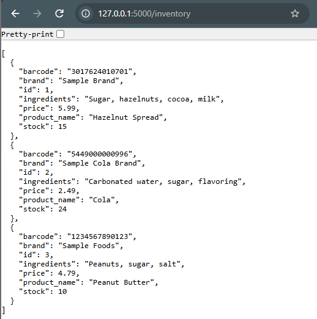
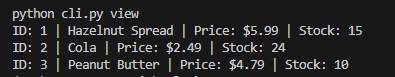
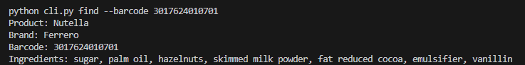
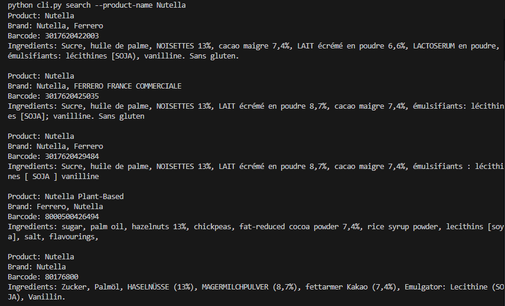
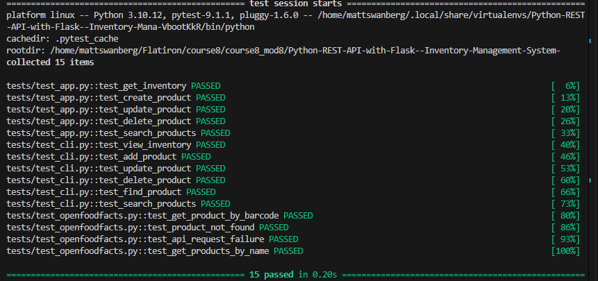

# Inventory Management System

A Python inventory management application built with Flask, a command-line interface (CLI), and the OpenFoodFacts API.

The application provides a REST API for managing inventory items and a CLI for interacting with the API. Users can create, view, update, and delete inventory products as well as search OpenFoodFacts for real-world product information.

## Features

- View all inventory items
- View a specific inventory item by ID
- Add new inventory items
- Update product price and stock
- Delete inventory items
- Search OpenFoodFacts by barcode
- Search OpenFoodFacts by product name
- Add products retrieved from OpenFoodFacts directly to inventory
- Handle missing products and invalid requests
- Simulate inventory storage using an in-memory Python list
- Test API routes, CLI functionality, and external API interactions with pytest

## Technologies Used

- Python
- Flask
- Requests
- OpenFoodFacts API
- argparse
- pytest
- unittest.mock
- Pipenv
- Git / GitHub

## Project Structure

```text
.
├── app.py
├── cli.py
├── data.py
├── helpers.py
├── openfoodfacts.py
├── tests/
│   ├── __init__.py
│   ├── test_app.py
│   ├── test_cli.py
│   └── test_openfoodfacts.py
├── .gitignore
├── Pipfile
├── Pipfile.lock
└── README.md
```

## Installation

Clone the repository and navigate into the project directory:

```bash
git clone <your-repository-url>
cd <your-project-directory>
```

Install the project dependencies using Pipenv:

```bash
pipenv install
```

Install the development dependencies if needed:

```bash
pipenv install --dev
```

Enter the virtual environment:

```bash
pipenv shell
```

## Running the Flask API

Start the Flask application:

```bash
python app.py
```

The API will run locally at:

```text
http://127.0.0.1:5000
```

The CLI communicates with the Flask server, so the server should remain running while CLI commands are used.

## API Endpoints

| Method | Endpoint | Description |
| --- | --- | --- |
| GET | `/` | Display the API welcome message |
| GET | `/inventory` | Retrieve all inventory items |
| GET | `/inventory/<id>` | Retrieve an inventory item by ID |
| POST | `/inventory` | Add a new inventory item |
| PATCH | `/inventory/<id>` | Update an existing inventory item |
| DELETE | `/inventory/<id>` | Delete an inventory item |
| GET | `/products/<barcode>` | Find an OpenFoodFacts product by barcode |
| GET | `/products/search/<product_name>` | Search OpenFoodFacts by product name |
| POST | `/inventory/from-api/<barcode>` | Retrieve an OpenFoodFacts product and add it to inventory |

## Inventory Data Format

Inventory items use the following structure:

```json
{
  "id": 1,
  "barcode": "3017624010701",
  "product_name": "Hazelnut Spread",
  "brand": "Sample Brand",
  "ingredients": "Sugar, hazelnuts, cocoa, milk",
  "price": 5.99,
  "stock": 15
}
```

Each inventory item contains a unique ID along with its barcode, product information, price, and available stock.

## API Examples

### View All Inventory Items

```http
GET /inventory
```

### View a Product by ID

```http
GET /inventory/1
```

### Add a Product

```http
POST /inventory
```

Example JSON request body:

```json
{
  "barcode": "1234567890",
  "product_name": "Example Product",
  "brand": "Example Brand",
  "ingredients": "Example ingredients",
  "price": 4.99,
  "stock": 10
}
```

### Update a Product

```http
PATCH /inventory/1
```

Example JSON request body:

```json
{
  "price": 5.49,
  "stock": 20
}
```

### Delete a Product

```http
DELETE /inventory/1
```

A successful deletion returns HTTP status `204`.

### Find an OpenFoodFacts Product by Barcode

```http
GET /products/3017624010701
```

The application retrieves product information from OpenFoodFacts and converts the returned data into the format used by the inventory application.

### Search OpenFoodFacts by Product Name

```http
GET /products/search/Nutella
```

Product-name searches return up to five matching products.

### Add an OpenFoodFacts Product to Inventory

```http
POST /inventory/from-api/3017624010701
```

Example JSON request body:

```json
{
  "price": 6.99,
  "stock": 12
}
```

Product details are retrieved from OpenFoodFacts while the price and stock values are supplied by the user.

## Command-Line Interface

The project includes a CLI in `cli.py` for interacting with the Flask API.

Make sure the Flask server is running before using these commands.

### View Inventory

```bash
python cli.py view
```

### Add a Product Manually

```bash
python cli.py add \
  --barcode "1234567890" \
  --product-name "Example Product" \
  --brand "Example Brand" \
  --ingredients "Example ingredients" \
  --price 4.99 \
  --stock 10
```

### Update a Product

Update both price and stock:

```bash
python cli.py update --id 1 --price 5.99 --stock 20
```

The price or stock can also be updated individually:

```bash
python cli.py update --id 1 --price 5.99
```

```bash
python cli.py update --id 1 --stock 20
```

### Delete a Product

```bash
python cli.py delete --id 1
```

### Find a Product by Barcode

```bash
python cli.py find --barcode 3017624010701
```

### Search for Products by Name

```bash
python cli.py search --product-name Nutella
```

The search displays up to five matching OpenFoodFacts products.

### Add an OpenFoodFacts Product to Inventory

```bash
python cli.py add-from-api \
  --barcode 3017624010701 \
  --price 6.99 \
  --stock 10
```

This retrieves the product information from OpenFoodFacts and adds the product to the local inventory with the supplied price and stock.

## OpenFoodFacts Integration

The application integrates with OpenFoodFacts to retrieve external product information.

The integration supports:

- Barcode-based product lookup
- Product-name search
- Mapping external product data to the inventory application's data structure
- Adding an OpenFoodFacts product directly to inventory
- Handling failed API requests and products that cannot be found

The application maps OpenFoodFacts product fields to the following inventory fields:

| Inventory Field | OpenFoodFacts Field |
| --- | --- |
| `product_name` | `product_name` |
| `brand` | `brands` |
| `ingredients` | `ingredients_text` |

Barcode searches use the OpenFoodFacts product API, while product-name searches use the OpenFoodFacts search service. Product-name results are limited to five products to keep the API and CLI output manageable.

## Data Storage

This project uses a Python list in `data.py` to simulate a database.

Changes made while the application is running modify the in-memory inventory list. Because the application does not use persistent database storage, inventory changes reset when the application is restarted.

## Error Handling

The application includes error handling for situations such as:

- Product not found
- Missing required product fields
- Missing update data
- Missing price or stock when adding an API product
- Failed OpenFoodFacts requests
- OpenFoodFacts searches with no matching products

The API uses appropriate HTTP status codes, including:

- `200` - Successful request
- `201` - Product successfully created
- `204` - Product successfully deleted
- `400` - Invalid or missing request data
- `404` - Product not found

## Testing

The project uses `pytest` for automated testing.

Run the complete test suite with:

```bash
pytest -v
```

The test suite covers the main application functionality, including:

- Flask API routes
- Inventory CRUD operations
- CLI commands
- OpenFoodFacts integration
- Mocked external API requests

External API requests are mocked where appropriate so the test suite does not depend on live OpenFoodFacts responses.

## Manual Testing

The Flask API can also be tested manually while the server is running.

Example:

```bash
curl http://127.0.0.1:5000/inventory
```

OpenFoodFacts barcode lookup:

```bash
curl http://127.0.0.1:5000/products/3017624010701
```

OpenFoodFacts product-name search:

```bash
curl http://127.0.0.1:5000/products/search/Nutella
```

API routes can also be tested using Postman.

## Screenshots

### Inventory Management System


### CLI






### Test Suite



## Big O Complexity Analysis

Although performance optimization was not a primary requirement for this project, time and space complexity were considered while designing the inventory operations.

Let `n` represent the number of products stored in the local inventory.

| Operation | Time Complexity | Explanation |
| --- | --- | --- |
| View all inventory | `O(n)` | Each inventory item must be returned or displayed. |
| Find product by ID | `O(n)` | The inventory list is searched sequentially until the matching ID is found. |
| Add product | `O(n)` | Generating the next ID requires scanning the existing inventory for the highest ID. Appending the new product itself is `O(1)`. |
| Update product | `O(n)` | The product must first be located by ID. Updating the selected fields is constant time because the number of supported fields is fixed. |
| Delete product | `O(n)` | The product is located using a linear search, and removing an item from a Python list may require shifting later elements. |
| Validate required fields | `O(k)` | The application checks each required field, where `k` is the number of required fields. Since the number of fields is small and fixed, this behaves like `O(1)` for this application. |
| OpenFoodFacts barcode lookup | `O(1)` locally | The external API performs the lookup. The application only maps a fixed number of returned fields. Network/API response time is not represented by Big O notation here. |
| OpenFoodFacts product-name search | `O(m)` locally | The application processes the products returned by OpenFoodFacts, where `m` is the number of search results returned by the external API. |

### Space Complexity

The primary local inventory is stored in a Python list, requiring:

```text
O(n)
```


## Author

Created by Matthew Swanberg as part of Course 8 Module 8 (Summative Lab: Python REST API with Flask- Inventory Management System)